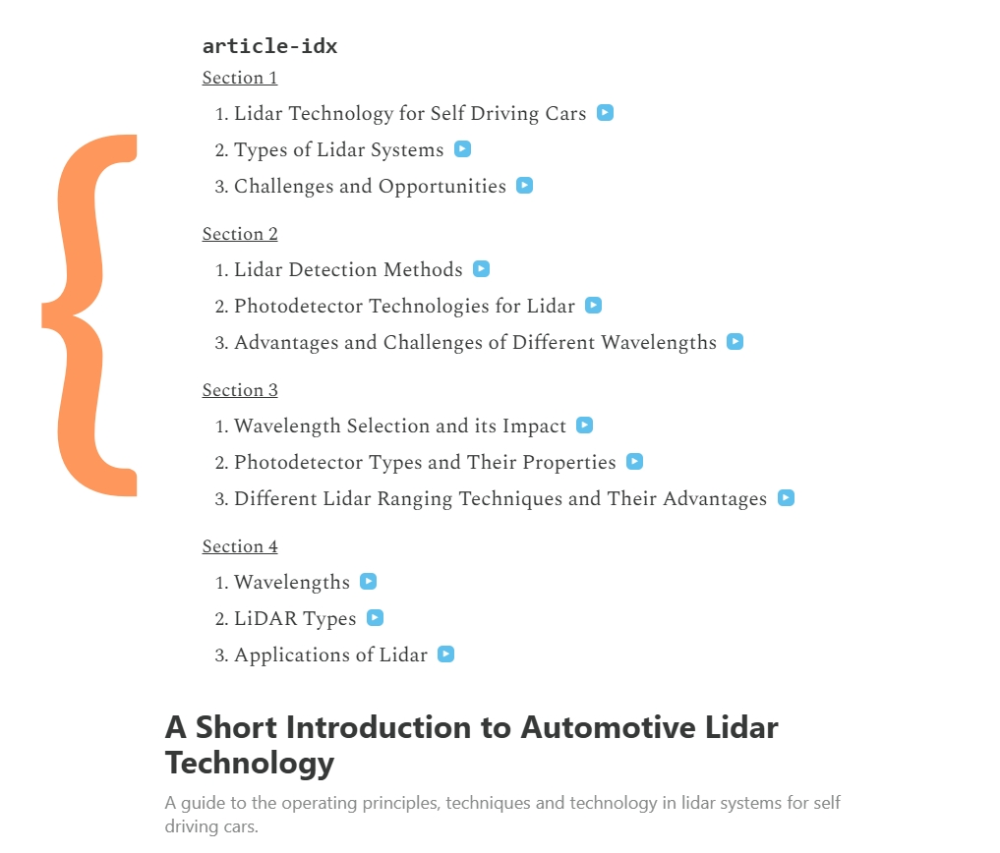
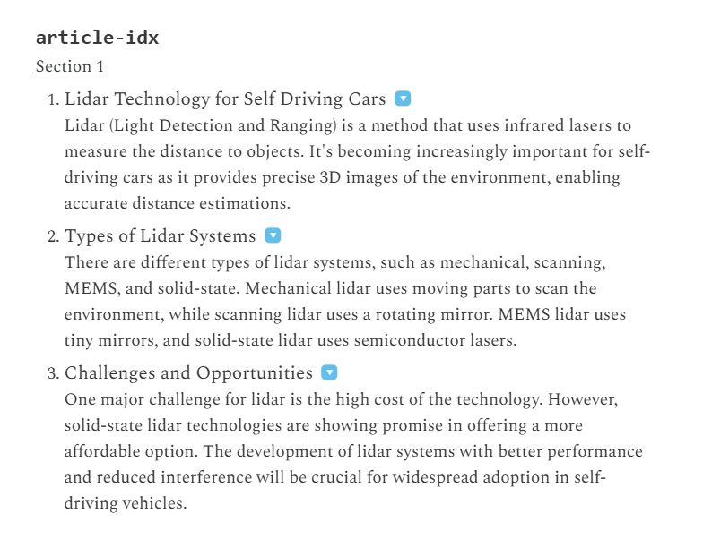

A Chrome plugin, which finds articles on your current webpage and creates and index (table of contents) above it. (at time of writing *only* works with Chrome Canary with AI support)

It does this by breaking the article up into sections, and using the LLM to summarize each section, providing 3 key ideas of that section. 

The user may jump to any any section in the source (article), and jump back up to the index.

In the options, the user may specify a whitelist of websites which this plugin will apply to.

# The Index is generated at the top of the article

# View the summaries

# Jump to the relevant section

